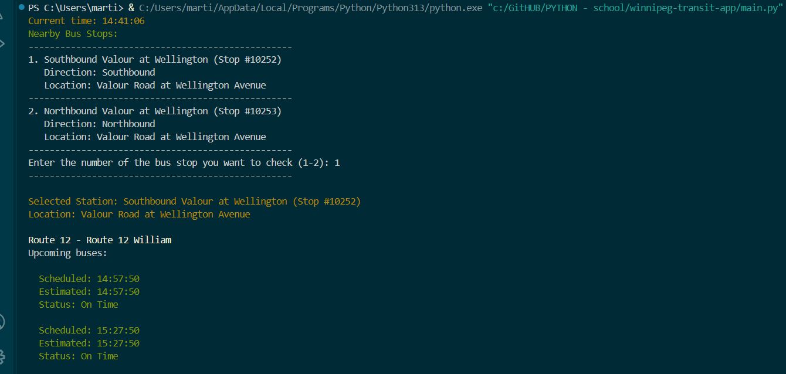

# Winnipeg Transit Bus Stop Viewer

## Description

The Winnipeg Transit Bus Stop Viewer allows users to find nearby bus stops and view the upcoming bus schedules. Users can input their GPS coordinates and retrieve information about the bus stops in the vicinity, including real-time updates on bus arrival times.

## Usage

1. **Run the program** using Python.
2. The program will automatically fetch nearby bus stops based on the predefined GPS coordinates.
3. The user will see a list of nearby bus stops along with their directions and locations.
4. **Select a bus stop** by entering its corresponding number.
5. The program will display the selected bus stop's information along with the upcoming bus schedules.

## Features

- Fetches nearby bus stops from the Winnipeg Transit API.
- Displays detailed information about each bus stop, including location and direction.
- Shows scheduled and estimated arrival times for buses at the selected stop.
- Color-coded status messages for bus timeliness (On Time, Late, Early).

## Screenshots

## Libraries Used

- **requests**: For sending HTTP requests to the Winnipeg Transit API.
- **dateutil**: For parsing and formatting date and time.
- **colorama**: For adding color to console output.

## API Information

This project utilizes the Winnipeg Transit API to fetch real-time data about bus stops and schedules. The API key is included in the program.
